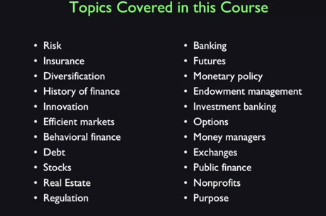

# Topics in Finance

## A List of Topics in Finance

Topics are:

- Risk
- Insurance
- Diversification
- History of Finance
- Innovation
- Behavioral Finance
- Debt
- Stocks
- Real Estate
- Regulation
- Banking
- Futures
- Monetary Policy
- Endowment Management
- Investment Banking
- Options
- Money Managers
- Exchanges
- Public Finance
- Nonprofit Finance
- Purpose of Finance

## W1L2

### Var Variance/Value at Risk

Value at risk is a measure used by some finance people to quantify risk of of an investment or of a portfolio and it's quoted in units of dollars for a given probability and time horizon. For example, if it says lets's say 1%, one-year value at risk of 10 million, it means that there is a 1% chance that the portfolio will lose 10 million in one year.

### Stress Testing

The stress test is a test usually ordered by government to see how some firm will stand up to a financial crisis.

### S&P 500
